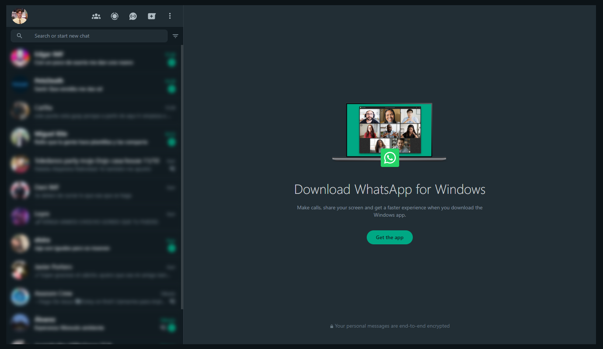

# WhatsBlur

Don't let people peek at your recent chats when you're using WhatsApp Web in public!

Blurs the chat list and the chat window when you're not hovering over them.

## Installation

To install the extension, follow these steps:

1. Download the `whatsblur` folder.
2. Open Google Chrome or Edge and go to `chrome://extensions`.
3. Turn on Developer mode.
4. Click on "Load unpacked" and select the `whatsblur/src/` folder.
5. The extension should now be installed and ready to use.

## License

This project is licensed under the MIT License - see the [LICENSE](LICENSE) file for details.

## Notes

- This extension is not affiliated with WhatsApp or Meta in any way.
- This extension is not yet finished. It is still in development, some features may not work as expected.
- This extension is not yet available on the Chrome Web Store or any other extension store.
